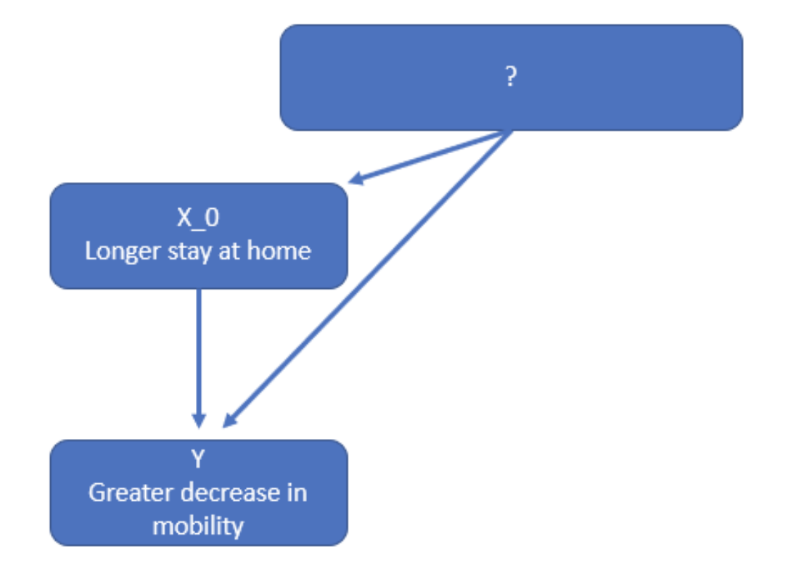
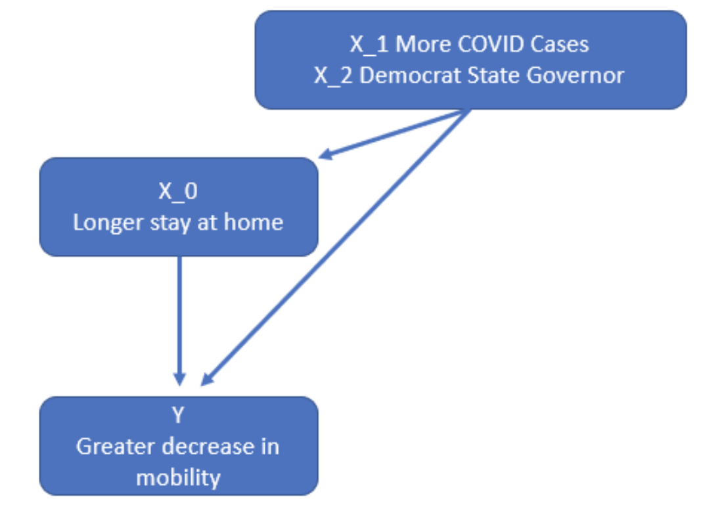
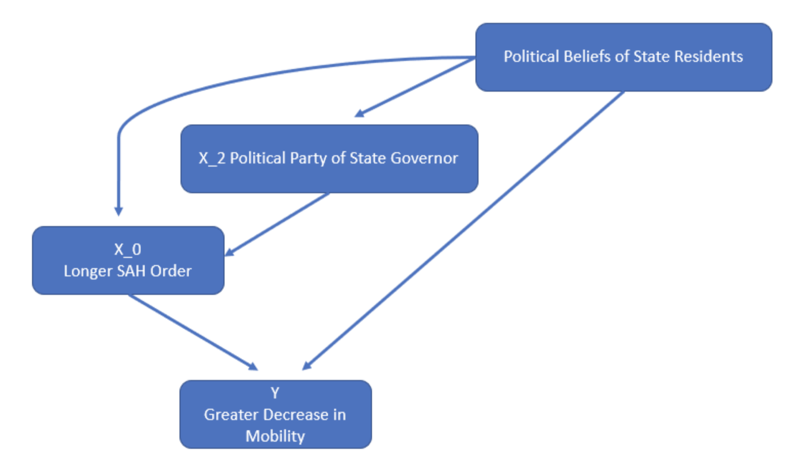
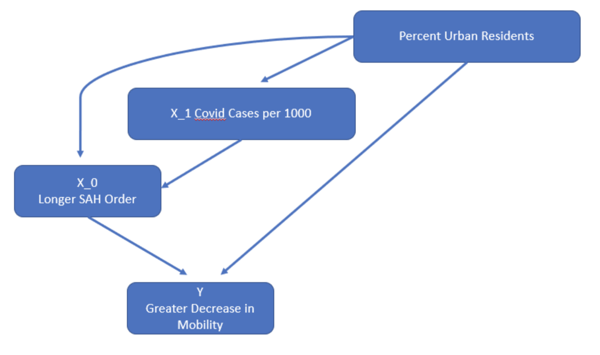

\newpage

```{r, echo=FALSE, include=FALSE}
knitr::opts_chunk$set(echo = TRUE)

## Load packages for pre-processing and model building
library(tidyverse)
library(sandwich)
library(lmtest)
library(gridExtra)
library(ggplot2)
library(ggpubr)
library(magrittr)
library(lubridate)
library(dplyr)
library(openxlsx)
library(stargazer)
```

```{r, echo=FALSE, warning=FALSE, message=FALSE}

##########################################
##### Pre-processing of raw datasets #####
##########################################

## Import datasets
mobility <- read.csv('../data/raw/2020_US_Region_Mobility_Report.csv',
                     stringsAsFactors = F)
stateInfo <- read.xlsx('../data/raw/COVID-19 US state policy database 3_17_2021.xlsx',
                      sheet = 1, detectDates = T) %>%
   ## Filter out the filler rows
  filter(!(STATE %in% c('State', 'category', 'type', 'unit'))) 

ACS <- read.csv('../data/raw/ACSDP1Y2019.DP05-2021-04-04T224220.csv', stringsAsFactors = F)

govParty <- read.csv('../data/raw/Gov_Party.csv', stringsAsFactors = F)

## Bring in COVID data - this is CDC data, not NYT because it's already incremental and easier to work with
COVIDData <- read.csv('../data/raw/United_States_COVID-19_Cases_and_Deaths_by_State_over_Time.csv', stringsAsFactors = F) 

## Subset mobility data down to only state rows and convert the date to a date
stateLevel <- mobility %>% filter(sub_region_1 != '', 
                                  sub_region_2 == '') %>%
                           mutate(Date = ymd(date))

## Subset to just the aggregate US level values for graphs
usLevel <- mobility %>% filter(sub_region_1 == '', 
                               sub_region_2 == '') %>% 
                          mutate(Date = ymd(date))

## ACS data prep

### Get usable variable names
ACS %<>% select(c(Label, contains('Estimate')))
names(ACS) <- gsub('..Estimate', '', names(ACS))
names(ACS) <- gsub('\\.', ' ', names(ACS))

### Transpose the dataframe
ACS <- as.data.frame(t(as.matrix(ACS)))
ACS %<>% tibble::rownames_to_column('State')
ACS[1,1] <- 'State'

names(ACS) <- make.names(as.matrix(ACS[1, ]))

#### Remove the header row
ACS <- ACS[-1, ] 

#### Select down to the columns we want - can't do this by names because of duplicates
ACS <- ACS[, c(1, 3, 6, 10, 11, 20, 30)]

#### Clean up the two vars we want - need to play around because matrix converts to factors
ACS %<>% mutate(Population = as.numeric(gsub(',', '', as.character(X....Total.population))), 
                MedianAge = as.numeric(as.character(X........Median.age..years.)), 
                SexRatio = as.numeric(as.character(X........Sex.ratio..males.per.100.females.)),
                SexRatioGt65 = as.numeric(as.character(X............Sex.ratio..males.per.100.females.)),
                YoungPopPcnt = (as.numeric(gsub(',', '', as.character(X........15.to.19.years))) + as.numeric(gsub(',', '', as.character(X........20.to.24.years)))) / Population
                  ) %>%
  select(-X....Total.population, -X........Median.age..years., -X........Sex.ratio..males.per.100.females.,
         -X............Sex.ratio..males.per.100.females., -X........15.to.19.years, -X........20.to.24.years)

startDate <- '2020-03-15'
endDate <- '2020-06-15'

##  Create the modeling dataset
modDat <- stateLevel %>%
  filter(Date >= startDate,
         Date <= endDate) %>%
  group_by(sub_region_1) %>%
  summarise(y_var = median(retail_and_recreation_percent_change_from_baseline)) %>%
  left_join(stateInfo, by = c('sub_region_1' = 'STATE')) %>%
  mutate(stay = case_when(STAYHOME > 0 ~ '1',
                          TRUE ~ '0'),
         length = case_when(STAYHOME > 0 & ymd(STAYHOME) > startDate & ymd(END_STHM) < endDate ~ ymd(END_STHM) - ymd(STAYHOME),
                            STAYHOME > 0 & ymd(STAYHOME) > startDate & ymd(END_STHM) > endDate ~ ymd(endDate) - ymd(STAYHOME),
                            STAYHOME > 0 & ymd(STAYHOME) < startDate & ymd(END_STHM) < endDate ~ ymd(END_STHM) - ymd(startDate),
                            STAYHOME > 0 & ymd(STAYHOME) < startDate & ymd(END_STHM) > endDate ~ ymd(endDate) - ymd(startDate),
                            TRUE ~ 0)) %>% 
  left_join(ACS, by = c('sub_region_1' = 'State')) %>%
  left_join(govParty, by = c('sub_region_1' = 'State')) %>%
  left_join(
    COVIDData %>%
      filter(!is.na(submission_date)) %>%
      filter(mdy(submission_date) >= startDate,
             mdy(submission_date) <= endDate) %>%
      group_by(state) %>%
      summarise(new_case = sum(new_case)),
    by = c('POSTCODE' = 'state')
  ) %>%
  mutate(new_case_per_thousand = new_case / Population * 1000)

# write.csv(modDat, '../data/processed/processed.csv', row.names = F)

```


# 1. An Introduction

## Context

In Spring of 2020 as the novel COVID-19 pandemic made waves across headlines, United States (US) state-level governments attempted to slow community spread of COVID through Stay at Home (SAH) orders. By the end of March 2020, 39 states had an active SAH order that limited its citizens' movement patterns, impacting an estimated \href{https://www.nbcnews.com/news/world/75-million-americans-under-virtual-lockdown-after-italy-suffers-huge-n1165591}{\bf 75 million Americans}, roughly one-fifth of the US population. This represented one of the strongest public policy interventions in modern American history, whereby mandates leveraged by state governments greatly impacted constituent freedom of choice.

State leadership such as Governor Newsom of California and Governor Cuomo of New York were praised for early action. However, the ramifications of the state-issued SAH orders revealed to be immense and devastating in scope. The SAH orders spurred a complimentary set of closure orders resulting in job loss, delays in healthcare treatment, and an economic halt. This was all done in the name of public health. 

More than one year later, SAH orders are still re-implemented by local governments as a response to surges in COVID cases. Importantly, SAH orders will likely be implemented during future health disasters as well.


## Research Focus
 
We believe it is imperative to understand the effectiveness of SAH policies so that policymakers can better weigh the benefits and drawbacks of such directives in the future, and it is through this lens that we frame our research.

We examine the effectiveness of SAH orders in reducing citizen mobility, and we aim to understand whether Americans in states with SAH orders imposed adhered to the orders and limited their non-essential activities. Formally, our research seeks to find a correlation between the length of a state's SAH order and the reduction in its constituent mobility during lockdown. If we establish that such a relationship exists, policymakers will have a baseline from which they can quantify the efficacy of their policy tools. A natural next step beyond this research would be to evaluate the effect of reduced citizen mobility on the spread of COVID, thereby completing a causal chain. However, this paper will be limited in scope to the former question.

## Research Operationalization

We will focus our study during a research window that spans from 3/15/20 to 6/15/20, a period of 92 days. This time period coincides with the first COVID wave in the US (Figure 1), and is the time period during which states differed in their SAH order policies. Prior to 3/15/2020, no states had implemented SAH orders, and after 6/15/2020, only New York, California, Oregon, and New Hampshire had a SAH order in place. Thus, our research window serves as a standardized time period that captures most states' SAH orders.

It is with respect to this first US COVID wave that we examine changes in citizen mobility, as opposed to subsequent spikes in cases, in order to control for confounding factors. Due to the US's decision to delegate COVID measures to the state level, differences in each state’s approach becomes compounded due to unique county and state -wide conditions. Additionally, since our research focuses on citizen mobility, the Spring season helps to control for the impacts of extreme seasonality (e.g., Winter, Summer) on COVID spread.

```{r, echo=FALSE, message=FALSE, warning=FALSE, fig.height=4, fig.width=6, fig.cap="\\label{fig:figs}First US COVID Wave (dotted lines represent research window from 3/15/2020 to 6/15/2020"}

## Prep COVID data to show waves
COVIDout <- COVIDData %>%
  mutate(submission_date = mdy(submission_date)) %>%
  filter(state %in% modDat$POSTCODE,
         !is.na(submission_date)) %>%
  group_by(submission_date) %>%
  summarise(new_cases = sum(new_case))

# fig1 = ggplot(COVIDout %>% filter(submission_date >= '2020-03-01'), aes(x = submission_date, y = new_cases)) +
#   geom_point() + stat_smooth() + ggtitle("US COVID Case Spread") + 
#   labs(y = 'New COVID Cases', x = 'Time')

fig2 = ggplot(COVIDout %>% filter(submission_date >= '2020-03-01',
                           submission_date < '2020-07-01'), aes(x = submission_date, y = new_cases)) +
  geom_point() + stat_smooth() +
  labs(y = 'New COVID Cases', x = 'Month (2020)') + 
  geom_vline(xintercept = as.numeric(ymd('2020-03-15')), linetype='dotted') + 
  geom_vline(xintercept = as.numeric(ymd('2020-06-15')), linetype='dotted') +
  ylim(0,50000)

fig2

# figure <- ggarrange(fig1, fig2, ncol = 1, nrow = 2)

# figure
```


The dependent variable we capture is the change in citizen mobility, which serves as a proxy for the degree of adherence citizens have toward the SAH order imposed in their states. We leverage \href{https://www.google.com/covid19/mobility/}{\bf Google mobility reports}, an anonymized dataset that aggregates the location data of users of Google products, to evaluate the degree to which citizens adhered to SAH orders. Mobility metrics are calculated by Google against a baseline set as the median mobility value from the 5‑week period of 1/3/2020 – 2/6/2020, and are reported as a percent change with respect to this baseline. Established baselines values vary in time and location. Full documentation of Google's datasets can be found \href{https://support.google.com/covid19-mobility?hl=en#topic=9822927}{\bf here}.  

While there are many mobility measures that Google reports on including "transit stations", "parks", and the "workplace", our research will focus on the change in mobility for the "retail and recreation" category. Unlike the other categories, we believe that "retail and recreation" best captures the type of non-essential activity SAH policies intend to reduce.

## Limitations of Data

We acknowledge that there are limitations to the datasets and we make assumptions that surround our research. Notwithstanding, we believe it is  appropriate to proceed with our research. Although these caveats may increase noise and decrease the precision of our results, they do not systematically bias our findings in any meaningful way:

- State-imposed SAH orders have varying restrictions on movement. North Carolina, for example, issued a SAH order that \href {https://www.americanprogress.org/issues/religion/news/2020/03/27/482359/religious-exemptions-coronavirus-pandemic-will-worsen-crisis/}{\bf exempts places of worship} on the basis that they operate as an essential activity. There is a lack of normalization in what a SAH order may mean between state lines.
- Google mobility reports are a good proxy for citizen movement, but they are not perfect. Google implements a \href{https://youtu.be/FfAdemDkLsc}{\bf differential privacy algorithm} to intentionally add noise to data in order to mask individual user behavior. Although this preserves user privacy, this hurts our model accuracy, as the dataset deviates for reality. Additionally, individuals who do not use Google products or who have Location History turned off will not have their mobility data recorded, which makes the dataset unrepresentative of reality. However, we believe this will not systematically bias Google mobility reports in a way that will skew the results of our research. (Interestingly, other companies such as \href{https://covid19.apple.com/mobility}{\bf Apple} have also released their versions of mobility reports that detail their user bases. In the interest of preserving scope, we have not examined these reports in detail, although this could be an extension of our research for future studies.)


\newpage
# 2. A Model Building Process

```{r, echo=FALSE, message=FALSE, warning=FALSE}
df <- read_csv('../data/processed/processed.csv')
```


The models we create aim to describe the effect of independent variables on the dependent variable. In subsequent sections, we construct three models, each of which adds complexity in the form of introducing additional independent variables. 

Formally, the dependent variable is the median percent change in "retail and recreational" (R&R) mobility in all 50 states, as well as the District of Columbia, during the research window that spans from 3/15/2020 to 6/15/2020. A lower, more negative value for the dependent variable corresponds to a greater median reduction in mobility during the research window. For example, Alabama and Pennsylvania observed median mobility reductions of -15% and -34%, respectively. Thus, we can conclude that Pennsylvania had a greater median reduction in mobility than Alabama during the research window, as compared to the states' respective pre-COVID, baseline movement patterns.  

We choose to examine the median percent change in mobility, instead of another aggregate such as mean, for two benefits. Firstly, using the median aligns with Google's methodology of setting the baseline with which all daily comparisons are made. Secondly, the median will be less sensitive to anomalous fluctuations in mobility throughout the research window as compared to the mean.  

For the duration of this analysis, we will use use $\alpha = 0.05$ to determine statistical significance in accordance with common industry practices. 

\newpage
## Model 1

### Variables
In our most limited model, we examine the relationship that a state's SAH order duration has on the dependent variable. To calculate the length of a SAH order, we rely on the \href{https://github.com/USCOVIDpolicy/COVID-19-US-State-Policy-Database}{\bf COVID-19 US State Policy Database}, a repository maintained by the Boston University School of Public Health. This dataset contains start and end dates for each state's SAH order, which we convert to a single integer representing the number of days a SAH order is imposed for a given state. This calculation is dependent on a state having imposed a SAH order that explicitly restricts movement of the general public. Certain states, such as Connecticut, imposed SAH orders that did not limit movement. We treat these states as having a SAH order length of 0 days.

### Modeling Goal
Our modeling goal is to build an explanatory model to determine if a relationship exists between SAH order length and citizen mobility.

### EDA

Our initial EDA shows a strong, linear relationship between our SAH order length and the dependent variable (Figure 2). SAH order length covers the span of real-valued positive intergers, truncated at length of our observation window. Therefore, we will treat this feature as a numeric. 

```{r, echo=FALSE, message=FALSE, warning=FALSE, fig.height=3, fig.width=6, fig.cap="\\label{fig:figs}Model 1 EDA, Linear Relationship Exhibited When States Without SAH Order Included"}

df %>%
  select(length,y_var) %>%
  ggplot(aes(x=length,y=y_var))+
  geom_point()+stat_smooth(method='lm')+
  labs(x='SAH Order Length',y='Median Reduction in R&R Mobility')

```

However, we notice the cluster of states that did not implement a mobility-restricting SAH order and the horizontal gap in which no states implemented a SAH order between 1 to 23 days in length. We observe these attributes will impact how a linear predictor fits the data. If we removed the data points representing states that did not implement a mobility-restricting SAH order, we observe that a non-linear relationship may describe the relationship more meaningfully (Figure 3). This matches our intuitive sense, as we would expect the effects of a SAH order on mobility to taper off at the extremes. 

```{r, echo=FALSE, message=FALSE, warning=FALSE, fig.height=3, fig.width=6, fig.cap="\\label{fig:figs}Model 1 EDA, Non-Linear Relationship Exhibited When States Without SAH Order Excluded"}

df %>%
  select(length,y_var) %>%
  filter(length>0) %>%
  ggplot(aes(x=length,y=y_var))+
  geom_point()+stat_smooth()+
  labs(x='SAH Order Length',y='Median Reduction in R&R Mobility')+
  lims(x=c(0,90))

```

In Figure 4, we observe the distribution of our dependent variable does appear to exhibit a slightly heavier left tail than a normal distribution as a result of a few states having far lower reductions in R&R mobility than other states. This dependent variable is real-valued and will therefore be treated as a numeric target for our modeling.   

```{r, echo=FALSE, message=FALSE, warning=FALSE, fig.height=3, fig.width=6, fig.cap="\\label{fig:figs}Model 1 EDA, Distribution of the Dependent Variable"}

df %>%
  select(y_var) %>%
  ggplot(aes(x=y_var))+
  geom_histogram()+
  labs(x='Median Reduction in R&R Mobility',y='Number of States')

```

### Transformations

Based on the EDA, we may consider excluding the states that did not implement a mobility-restricting SAH order. However, this causes our model to be less interpretable. Given that our goal is not to perfectly describe the relationship between SAH order length and the dependent variable in this first, most limited model, but rather to build an explanatory model showing that changes in the independent variable may cause changes of magnitude in the dependent variable, we decided against applying the aforementioned transformation.

Further, although we do notice a deviation from normality for our dependent variable, the deviation from normality is not strong enough to suggest using a transformation that may hurt the interpretability of this study. Our aim with Model 1 is to generalize a trend while preserving model interpretability.

### Model Construction

Model 1 is reported as: $Y = -18.5 + -0.25*X_0$, where:  
- $Y$: median percent change in R&R mobility  
- $X_0$: Length of SAH order during the 92 day research window from 3/15/20 to 6/15/20, in days  

```{r}
model1 = lm(y_var~1+length,data=df)
summary(model1)$coefficients[1:2, 1:2]
```

### Evaluation

```{r}
coeftest(model1, vcov = vcovHC(model1))
# summary(model1) # Adjusted R-squared:  0.4295 
```
The p-values, using robust standard errors, for the intercept and independent variable, SAH length, are 5.436e-14 and 1.651e-07, respectively, indicating statistically significant relationships. We also find an adjusted R-squared value of 0.4295. An ANOVA against the base model, which excludes SAH length as a variable, reports Pr(>F) = 1.08e-07.

```{r}
model_base <- lm(y_var~1,data=df)
anova(model1,model_base,test='F')
```

We observe that changes in $X_0$ have a significant relationship with changes in $Y$.

However, as our modeling and analysis goal is explanatory, we need to evaluate the likelihood of causality. There are two potential factors that could undermine the establishment of causality:

1. \emph{Reverse causality}: Reverse causality would imply that reductions in mobility would cause longer SAH orders, which violates intuition and is therefore unlikely. SAH orders were issued by local governments with the explicit intent to reduce citizen movement as a community mitigation measure to slow the spread of COVID. We would expect states with reduced mobility to potentially lift SAH orders sooner as the mandate would appear unnecessary.

2. \emph{Omitted variable bias}: There is substantial risk of omitted variable bias undermining the explanatory power of Model 1  (Figure 5).  There are several variables not included in Model 1 that may cause both longer SAH orders and decreases in mobility, creating a strong bias away from zero.  We explore these independent variables in Model 2.

{width=400px}


\newpage
## Model 2  


### Variables  

In our second model, we include two additional variables in our analysis: the political party of the state's governor and new COVID case count per 1000 residents during the research window. The political party of the state's governor serves as a proxy for the political beliefs of the state's residents, and the COVID case count per 1000 residents serves as a normalized comparison of COVID severity between states.  

### Modeling Goal

The goal of our second model is again explanatory, but with a focus on covariates that could have a relationship both with the dependent variable, $Y$, and the SAH length, $X_0$. If we observe that these covariates are significant, it could undermine confidence in the explanatory power of Model 1.

### EDA

Based on our EDA (Figure 6), it appears there exists a relationship between COVID cases per 1000 residents and the median reduction in mobility. The more COVID cases a state records per 1000 residents, the greater the median reduction in mobility. This feature is a positive, real-valued number and will be treated as a numeric covariate. 
Additionally, there appears to exist a relationship between political beliefs and the median reduction in mobility. In states with Democratic Governors, the median reduction in mobility was greater in magnitude. This variable is a factor where Democratic governors will be grouped with the base and states with Republican governors will have an associated beta value.  


```{r, echo=FALSE, message=FALSE, warning=FALSE, fig.height=3, fig.width=6, fig.cap="\\label{fig:figs}Model 2 EDA, Effects of $X_1$ and $X_2$ on $Y$"}

p1 <- df %>%
  select(y_var,new_case_per_thousand) %>%
  ggplot(aes(x=new_case_per_thousand,y=y_var))+
  geom_point()+stat_smooth(method='lm')+
  labs(x='Cases per Thousand Residents',y='Median Reduction in R&R Mobility')

p2 <- df %>%
  select(y_var,Party) %>%
  ggplot(aes(x=Party,y=y_var))+
  geom_point()+stat_smooth(method='lm')+
  labs(x='Political Party of State Governor',y='Median Reduction in R&R Mobility')

grid.arrange(p1,p2,nrow=1,ncol=2)

```

This potentially undermines the explanatory power of Model 1, as both of these independent variables may also explain positive changes in the $X_0$ variable, SAH Order Length, thus biasing Model 1's beta coefficient away from zero. To further assess this possibility, we explore the relationship between our independent variables.  

```{r, echo=FALSE, message=FALSE, warning=FALSE, fig.height=3, fig.width=6, fig.cap="\\label{fig:figs}Model 2 EDA, Effect of $X_1$ and $X_2$ on $X_0$"}
p3 <- df %>%
  select(length,new_case_per_thousand) %>%
  ggplot(aes(x=new_case_per_thousand,y=length))+
  geom_point()+stat_smooth(method='lm')+
  labs(x='Cases per Thousand Residents',y='SAH Length')

p4 <- df %>%
  select(length,Party) %>%
  ggplot(aes(x=Party,y=length))+
  geom_point()+stat_smooth(method='lm')+
  labs(x='Political Party of State Governor',y='SAH Length')

grid.arrange(p3,p4,nrow=1,ncol=2)

```

We observe in Figure 7 that more COVID cases per 1000 residents appears to be correlated with longer SAH orders. Similarly, states with Democratic Governors correlated with longer SAH orders.

### Transformations
Based on our EDA, no transformations appear to be called for. 

### Model Construction

Model 2 is reported as: $Y = -20.73 - 0.17*X_0 - 0.74*X_1 + 6.06*X_2$, where:  
- $Y$: median percent change in R&R mobility  
- $X_0$: Length of SAH order during the 92 day research window from 3/15/20 to 6/15/20, days  
- $X_1$: Party of Governor (0 = Democrat, 1 = Republican)  
- $X_2$: Total new COVID cases per 1000 residents during the research window  

```{r}
model2 = lm(y_var~1+length+new_case_per_thousand+Party,data=df)
summary(model2)$coefficients[, 1:2]
```


### Evaluation

```{r}

coeftest(model2, vcov = vcovHC(model2))

anova(model2,model1,test='F')

```

When covariates $X_1$ and $X_2$ are introduced, we observe that both the magnitude and p-value for $X_0$ decreases substantially. Additionally, $X_1$ and $X_2$ both have a statistically significant relationship with $Y$.

This calls into question the explanatory power of the $X_0$ variable, SAH order length, as the causal chain may resemble Figure 8:

{width=400px}


Calculating the omitted variable bias in Model 1 against models that include $X_1$ and $X_2$ separately, we observe:

$Y = -18.51 + -0.25*X_0$  
$Y = -14.41 + -0.22*X_0 + -0.88*X_1$  
Omitted variable bias  =  B1 - B1 = -0.03  

$Y = -18.50 + -0.25*X_0$  
$Y = -25.10 + -0.18*X_0 + 7.49*X_2$  
Omitted variable bias  =  B1 - B1 = -0.07  

```{r}
model2_1 <- lm(y_var~1+length+new_case_per_thousand,data=df)
model2_2 <- lm(y_var~1+length+Party,data=df)

coeftest(model2_1, vcov = vcovHC(model2_1))
coeftest(model2_2, vcov = vcovHC(model2_2))
```

We observe that the omitted variable bias is away from zero in both cases. 

Although Model 2 still shows that SAH order length has the most significant relationship with the dependent variable, it raises concerns about the explanatory power of SAH order length. As we are working with limited data, our models may not fulfill all assumptions of the Classical Linear Model. This will be addressed in further detail in the \emph{Limitations of Model} section.


\newpage
## Model 3

### Variables

In our third model, we include two additional variables in addition to previous variables: the median age of residents and the percentage of residents at risk for serious COVID infection, both of which are postive real-valued variables and will be treated as numeric. Regarding the former variable, we hypothesize younger residents, who will have a greater tolerance for risk relative to older residents, may be less inclined to adhere to SAH orders. Regarding the latter variable, we hypothesize that residents at greater relative risk for serious COVID infection may be less inclined to adhere to SAH orders.


### Modeling Goal
The goal of our third model is again explanatory, as we are seeking to determine if additional covariates that may naturally cause citizens to reduce their mobility may also explain the reduction in median R&R mobility observed across states.

### EDA
In our EDA, we observe that median age and the percent of residents at risk for serious COVID illness do not appear to show a strong relationship with the Y variable (Figure 9). Furthermore, the percent of residents at risk for serious COVID illness actually appears to show the opposite relationship with the Y variable than intuition would suggest, indicating that states with a higher percent of people at risk for serious COVID illness experienced a lower median reduction in mobility during the research window.

```{r, echo=FALSE, message=FALSE, warning=FALSE, fig.height=4, fig.width=8, fig.cap="\\label{fig:figs}Model 3 EDA, Effect of $X_3$ and $X_4$ on $Y$"}
p5 <- df %>%
  select(y_var,MedianAge) %>%
  ggplot(aes(x=MedianAge,y=y_var))+
  geom_point()+stat_smooth(method='lm')+
  labs(x='Median Age',y='Median Reduction in R&R Mobility')

p6 <- df %>%
  select(y_var,RISKCOV) %>%
  ggplot(aes(x=RISKCOV,y=y_var))+
  geom_point()+stat_smooth(method='lm')+
  labs(x='Percent at Risk of Serious COVID Illness',y='Median Reduction in R&R Mobility')

grid.arrange(p5,p6,nrow=1,ncol=2)

```

### Transformations

Based on our EDA, no transformations appear to be called for. 

### Model Construction

Model 3 is reported as $Y = -30.40 - 0.16*X_0 - 0.55*X_1 + 5.13*X_2 - 0.77*X_3 + 1.02*X_4$, where:  
- $Y$: median percent change in R&R mobility  
- $X_0$: Length of SAH order during the 92 day research window from 3/15/20 to 6/15/20, days  
- $X_1$: Party of Governor  (0 = Democrat, 1 = Republican)  
- $X_2$: Total new COVID cases per 1000 people in the period    
- $X_3$: Median Age of State Residents    
- $X_4$: Percent of Residents at Risk for Serious COVID Infection  


```{r}
model3 <- lm(y_var~1+length+new_case_per_thousand+Party+MedianAge+RISKCOV,data=df)
summary(model3)$coefficients[, 1:2]
```


### Evaluation

```{r}
coeftest(model3, vcov = vcovHC(model3))
anova(model3,model2,test='F')
```

After incluing covariates $X_3$ and $X_4$, we observe that the p-value for $X_3$ is high, and that the direction of $X_4$ is actually the opposite of what intuition would suggest, which might be caused by this essentially being an outcome variable on the right side caused by an omitted variable such as lack of medical knowledge. This outcome leads us to believe covariates $X_3$ and $X_4$ do not carry strong explanatory power for changes in the $Y$ variable.

\newpage
# Regression Table

We summarize the variables from the 3 regression models in the regression table below.

```{r warning=FALSE}
se.model1 = coeftest(model1, vcov = vcovHC(model1))[ , "Std. Error"]
se.model2 = coeftest(model2, vcov = vcovHC(model2))[ , "Std. Error"]
se.model3 = coeftest(model3, vcov = vcovHC(model3))[ , "Std. Error"]

stargazer(model1, model2, model3, type = "text",
          se = list(se.model3),
          star.cutoffs = c(0.05, 0.01, 0.001), 
          title = paste("Table 1: A comparison of models that describe ",
          "the effect of SAH mandates on constituent mobility"))
```


\newpage
# Limitations of Model
We evaluated our model against the five Classical Linear Model (CLM) assumptions and find that Model 2 most reasonably satisfies the CLM requirements (Figure 10). To establish that our estimators in Model 2 are unbiased, we must establish that the data are independent and identically distributed (IID), that there is no perfect collinearity, and that a linear conditional expectation is met. While Model 2 shows evidence that there is no perfect collinearity (as evidenced by R not dropping a coefficient in the model as well as by applying the ocular test to the "Residuals vs Fitted" figure below), there are some IID considerations to note. There is likely a time dependence in our observations, as SAH orders are imposed in response to COVID spread. We attempt to mitigate this impact by focusing our analysis on the first wave of COVID in the US. These considerations of IID for Model 2 are noted as a limitation of our model. 

Next, we evaluate Model 2 for homoskedastic errors. While there is a mostly flat trendline in the below "Scale-Location" subplot, we detect a slight downward slope to the line plotted. A Breusch-Pagan test results in a p-value of 0.28, which fails to reject the null hypothesis and suggests there is a lack of evidence for heteroskedastic errors. To remain conservative in our practice, and because of the relatively small sample size of our analysis, we opt to default the model to robust standard errors.

The final CLM requirement of normally distributed errors is met through the ocular test of the "Normal QQ" plot as well as a statistical evaluation via the Shapiro-Wilk normality test. The	Shapiro-Wilk normality test yields a p-value of 0.14, which leads us to fail to reject the null hypothesis that we have normally distributed errors.  


```{r, fig.cap="\\label{fig:figs}Model 2 Summary Statistics"}
par(mfrow=c(2,2))
plot(model2)

# Assessing homoskedastic errors
bptest(model2)

# Assessing for normally distributed error
shapiro.test(model2$residuals)
```

\newpage
# Discussion of Omitted Variables

As part of the evaluation of Model 1, we noted its susceptibility to omitted variable bias and we identified two variables that could cause such biases: $X_1$ (COVID Cases per 1000 Residents) and $X_2$ (Political Party of State Governor). We then included these variables in Model 2. The Political Party of State Governor is a proxy for the political beliefs of the state's residents, which is an omitted variable discussed below. Additionally, we examine several omitted variables that may impact Models 2 and 3, below.

## Omitted Variable 1: Political Beliefs of State Residents
Model 2 includes $X_2$, Political Party of State Governor, which we observe was an omitted variable that had biased Model 1 away from zero (Figure 11). However, $X_2$ (Political Party of State Governor) is really just a rough proxy for the political beliefs of the state's residents. Our concern is that if political beliefs of the state's residents were included as a variable, it might be shown to have an even stronger relationship with SAH order length and the dependent variable of mobility, thus biasing Models 1 and 2 away from zero.  

For this reason we remain hesitant about the explanatory power of the SAH order length.

{width=400px}


## Omitted Variable 2: Percentage of Urban Residents

The percent of urban residents in a state is an omitted variable that could bias multiple coefficients in Model 2 away from zero (Figure 12). Residents in urban areas come in more frequent contact with other residents, increasing the risk of COVID spread. We would expect states with a higher percentage of urban residents to implement longer SAH Orders, experience a higher number of COVID cases, and observe residents in urban areas who are more inclined to reduce their R&R mobility due to higher perceived risk. This highlights the difficulty we face in ascribing clear explanatory power to SAH order length.  


{width=400px}

## Omitted Variable 3: New Unemployment Claims

New unemployment claims is an omitted variable that could affect SAH order length the dependent variable, and it would bias the SAH order length beta coefficient away from zero. We would expect states with a greater number of new unemployment claims to try to end their SAH order quickly because of negative economic impact or a SAH order. In addition, we would expect states with a relatively large number of new unemployment claims to observe a smaller median decrease in R&R mobility, as unemployed citizens will have extra time on their hands and may find it difficult to reduce their R&R mobility.


## Omitted Variable 4: Medical Knowledge

Medical knowledge is an omitted variable that may have a relationship with both COVID Cases per 1000 Residents and the dependent variable. We would expect that in states with lower average medical knowledge, there may be a greater number of COVID cases per 1000 residents and a smaller median decrease in R&R mobility.  This would bias our beta coefficient associated with COVID Cases per 1000 Residents toward zero. 

In addition, medical knowledge as an omitted variable may aid in explaining why the the Percent of Residents at Risk for Serious COVID Infection variable has a beta coefficient with a sign that is opposite of what intuition would suggest.  The Percent at Risk of Serious COVID Illness could be an outcome variable of the omitted variable, medical knowledge. In Model 3, we would have put this outcome variable on the right side. Lack of medical knowledge would cause both a greater number of citizens to be at risk of serious COVID illness due to pre-existing conditions such as tobacco use, obesity, and diabetes, as well as cause these same individuals to not limit their R&R mobility during COVID.


## Omitted Variable 5: Risk Tolerance

In Model 2, we observed that states with a greater number of COVID cases per 1000 residents saw a greater median decrease in R&R mobility.  Risk tolerance is an omitted variable that could have a relationship with both COVID Cases per 1000 Residents and the dependent variable. However, it would bias our beta coefficient toward zero. We could imagine that states with a greater average risk tolerance would have more COVID cases per 1000 residents and a smaller median decrease in R&R mobility.


\newpage
# Conclusion
Our exploratory analysis shows a statistically significant relationship between increasing lengths of implemented SAH orders and reductions in resident mobility for non-essential activities during the first wave of COVID in the United States, even when accounting for normalized COVID case count during the research window as well as the political party of the governor. These findings add to the body of literature that support CDC's guidance to local governments in issuing SAH orders as a measure to reduce mobility to limit COVID spread. As more data becomes available, we can begin to answer the question of whether these actions were worthwhile from a social and economic standpoint. We look to future research to continue this exploration to test the causal relationship between SAH order length and mobility reduction, as well as examine the impact that SAH orders may have had on reducing COVID infections and corresponding deaths.
