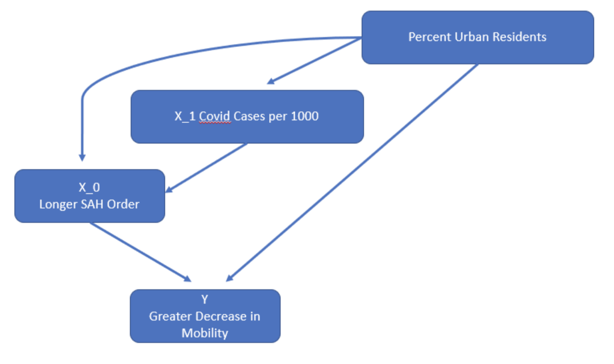

\newpage

```{r, echo=FALSE, include=FALSE}
knitr::opts_chunk$set(echo = TRUE)

## Load packages for pre-processing and model building
library(tidyverse)
library(sandwich)
library(lmtest)
library(gridExtra)
library(ggplot2)
library(ggpubr)
library(magrittr)
library(lubridate)
library(dplyr)
library(openxlsx)
library(stargazer)
```

```{r, echo=FALSE, warning=FALSE, message=FALSE}

##########################################
##### Pre-processing of raw datasets #####
##########################################

## Import datasets
mobility <- read.csv('../data/raw/2020_US_Region_Mobility_Report.csv',
                     stringsAsFactors = F)
stateInfo <- read.xlsx('../data/raw/COVID-19 US state policy database 3_17_2021.xlsx',
                      sheet = 1, detectDates = T) %>%
   ## Filter out the filler rows
  filter(!(STATE %in% c('State', 'category', 'type', 'unit'))) 

ACS <- read.csv('../data/raw/ACSDP1Y2019.DP05-2021-04-04T224220.csv', stringsAsFactors = F)

govParty <- read.csv('../data/raw/Gov_Party.csv', stringsAsFactors = F)

## Bring in COVID data - this is CDC data, not NYT because it's already incremental and easier to work with
COVIDData <- read.csv('../data/raw/United_States_COVID-19_Cases_and_Deaths_by_State_over_Time.csv', stringsAsFactors = F) 

## Subset mobility data down to only state rows and convert the date to a date
stateLevel <- mobility %>% filter(sub_region_1 != '', 
                                  sub_region_2 == '') %>%
                           mutate(Date = ymd(date))

## Subset to just the aggregate US level values for graphs
usLevel <- mobility %>% filter(sub_region_1 == '', 
                               sub_region_2 == '') %>% 
                          mutate(Date = ymd(date))

## ACS data prep

### Get usable variable names
ACS %<>% select(c(Label, contains('Estimate')))
names(ACS) <- gsub('..Estimate', '', names(ACS))
names(ACS) <- gsub('\\.', ' ', names(ACS))

### Transpose the dataframe
ACS <- as.data.frame(t(as.matrix(ACS)))
ACS %<>% tibble::rownames_to_column('State')
ACS[1,1] <- 'State'

names(ACS) <- make.names(as.matrix(ACS[1, ]))

#### Remove the header row
ACS <- ACS[-1, ] 

#### Select down to the columns we want - can't do this by names because of duplicates
ACS <- ACS[, c(1, 3, 6, 10, 11, 20, 30)]

#### Clean up the two vars we want - need to play around because matrix converts to factors
ACS %<>% mutate(Population = as.numeric(gsub(',', '', as.character(X....Total.population))), 
                MedianAge = as.numeric(as.character(X........Median.age..years.)), 
                SexRatio = as.numeric(as.character(X........Sex.ratio..males.per.100.females.)),
                SexRatioGt65 = as.numeric(as.character(X............Sex.ratio..males.per.100.females.)),
                YoungPopPcnt = (as.numeric(gsub(',', '', as.character(X........15.to.19.years))) + as.numeric(gsub(',', '', as.character(X........20.to.24.years)))) / Population
                  ) %>%
  select(-X....Total.population, -X........Median.age..years., -X........Sex.ratio..males.per.100.females.,
         -X............Sex.ratio..males.per.100.females., -X........15.to.19.years, -X........20.to.24.years)

startDate <- '2020-03-15'
endDate <- '2020-06-15'

##  Create the modeling dataset
modDat <- stateLevel %>%
  filter(Date >= startDate,
         Date <= endDate) %>%
  group_by(sub_region_1) %>%
  summarise(y_var = median(retail_and_recreation_percent_change_from_baseline)) %>%
  left_join(stateInfo, by = c('sub_region_1' = 'STATE')) %>%
  mutate(stay = case_when(STAYHOME > 0 ~ '1',
                          TRUE ~ '0'),
         length = case_when(STAYHOME > 0 & ymd(STAYHOME) > startDate & ymd(END_STHM) < endDate ~ ymd(END_STHM) - ymd(STAYHOME),
                            STAYHOME > 0 & ymd(STAYHOME) > startDate & ymd(END_STHM) > endDate ~ ymd(endDate) - ymd(STAYHOME),
                            STAYHOME > 0 & ymd(STAYHOME) < startDate & ymd(END_STHM) < endDate ~ ymd(END_STHM) - ymd(startDate),
                            STAYHOME > 0 & ymd(STAYHOME) < startDate & ymd(END_STHM) > endDate ~ ymd(endDate) - ymd(startDate),
                            TRUE ~ 0)) %>% 
  left_join(ACS, by = c('sub_region_1' = 'State')) %>%
  left_join(govParty, by = c('sub_region_1' = 'State')) %>%
  left_join(
    COVIDData %>%
      filter(!is.na(submission_date)) %>%
      filter(mdy(submission_date) >= startDate,
             mdy(submission_date) <= endDate) %>%
      group_by(state) %>%
      summarise(new_case = sum(new_case)),
    by = c('POSTCODE' = 'state')
  ) %>%
  mutate(new_case_per_thousand = new_case / Population * 1000)

# write.csv(modDat, '../data/processed/processed.csv', row.names = F)

```


# 1. An Introduction

## Context

In Spring 2020 as the onset of the COVID-19 splashed across headlines, US state governments attempted to slow community spread of COVID-19 through Stay at Home (SAH) orders. By the end of March 2020, 39 states had an active SAH order directing limitations to citizen movement integral to their everyday lives, impacting an estimated \href{https://www.nbcnews.com/news/world/75-million-americans-under-virtual-lockdown-after-italy-suffers-huge-n1165591}{75 million Americans}, roughly a fifth of the US population. This represented one of the strongest public policy interventions leveraged by state governments impacting citizen freedom of choice in modern history.

Early on, state leadership such as Governor Newsom of California and Governor Cuomo of New York were praised for early action. However the ramifications of the SAH orders issued by states revealed to be both immense in both scope and devastating in many dimensions. The SAH orders spurred a complimentary set of closure orders resulting in job loss, delay in healthcare treatment and a burgeoning crisis in youth development. This was all done in the name of public health. 

Over one year later from the start of the COVID-19 pandemic, SAH orders are still re-implemented by local governments as a response to episodes of increasing COVID-19 cases and hospitalizations. 


## Research Focus
 
We believe it is imperative to understand the effectiveness of SAH policies so that policymakers can better weigh the benefits and drawbacks of such directives in the future, and it is through this lens that we frame our research.

Our research examines the effectiveness of SAH orders in reducing citizen mobility, and we aim to understand whether Americans in states with SAH orders adhered to the orders to limit non-essential activities. Formally, our research seeks to find a correlation between the length of a state's SAH order, and the reduction in its constituent mobility during lockdown. If we establish that such a relationship exists, we will establish a foundational cornerstone in the continual evolution of SAH orders as a policy tool. The natural next step beyond this research would be to evaluate the effect of reduced citizen mobility on the spread of COVID-19, thereby completing a causal chain of this policy tool. However, this paper will be limited in scope to the former question.

## Research Operationalization

We will focus our study during our research window, from 3/15/20 to 6/15/20, a period of 92 days. This time period coincides with the first COVID wave in the United States (Figure 1), and is the time period in which states differed with respect to their SAH order policy. Prior to 3/15/2020, no states had implemented SAH orders, and after 6/15/2020, only New York, California, Oregon, and New Hampshire had a SAH order in place. Thus, our research window serves as a standardized time period that captures most states' SAH durations.

It is with respect to this first wave that we examine changes in citizen mobility, as opposed to subsequent waves to help control for confounding factors. Due to the hyperlocal strategy undertaken by the US, differences in each state’s approach became more pronounced based on local conditions as the pandemic continued. In addition, due to the focus on citizen mobility of our research, this Spring time period helps control for both the impact of seasonality and weather that may create differences in mobility by geography.  

```{r, echo=FALSE, message=FALSE, warning=FALSE, fig.height=4, fig.width=6, fig.cap="\\label{fig:figs}First US COVID Wave"}

## Prep COVID data to show waves
COVIDout <- COVIDData %>%
  mutate(submission_date = mdy(submission_date)) %>%
  filter(state %in% modDat$POSTCODE,
         !is.na(submission_date)) %>%
  group_by(submission_date) %>%
  summarise(new_cases = sum(new_case))

# fig1 = ggplot(COVIDout %>% filter(submission_date >= '2020-03-01'), aes(x = submission_date, y = new_cases)) +
#   geom_point() + stat_smooth() + ggtitle("US COVID Case Spread") + 
#   labs(y = 'New COVID Cases', x = 'Time')

fig2 = ggplot(COVIDout %>% filter(submission_date >= '2020-03-01',
                           submission_date < '2020-07-01'), aes(x = submission_date, y = new_cases)) +
  geom_point() + stat_smooth() +
  labs(y = 'New COVID Cases', x = 'Month (2020)') + 
  geom_vline(xintercept = as.numeric(ymd('2020-03-15')), linetype='dotted') + 
  geom_vline(xintercept = as.numeric(ymd('2020-06-15')), linetype='dotted') +
  ylim(0,50000)

fig2

# figure <- ggarrange(fig1, fig2, ncol = 1, nrow = 2)

# figure
```


The dependent variable we capture is the change in constituent mobility rate, which serves as a proxy for the degree of adherence citizens have toward the SAH order imposed in their states. We leverage \href{https://www.google.com/covid19/mobility/}{Google mobility reports}, an anonymized dataset that aggregates the location data of users of Google products, to evaluate the degree to which citizens adhered to SAH orders. Mobility metrics are calculated by Google against a baseline set as the median mobility value from the 5‑week period Jan 3 – Feb 6, 2020, and are reported as a percent change with respect to this baseline. Full documentation of Google's datasets can be found \href{https://support.google.com/covid19-mobility?hl=en#topic=9822927}{here}.  

While there are many mobility measures that Google reports, including "transit stations", "parks", and "workplace", our research will focus on the change in mobility for the "retail and recreation" category. Unlike the other categories, we believe that "retail and recreation" best captures the type of non-essential activity SAH policies intended to reduce in order to fulfill its objective of slowing the spread of COVID-19..


## ASSUMPTIONS?

## Limitations of Data

We acknowledge that there are limitations to the datasets and assumptions that surround our research. Notwithstanding, we believe it is still appropriate to proceed with our research. Although these caveats may increase noise and decrease accuracy of our results, they do not systematically bias our findings in any meaningful way.

- State-imposed SAH orders have varying restrictions on movement. North Carolina, as an example, issued a stay-at-home order that \href {https://www.americanprogress.org/issues/religion/news/2020/03/27/482359/religious-exemptions-coronavirus-pandemic-will-worsen-crisis/}{exempts places of worship} on the basis that they operate as an essential activity.
- Google mobility reports are a good proxy for citizen movement, but they are not perfect. Google implements a \href{https://youtu.be/FfAdemDkLsc}{differential privacy algorithm} to intentionally add noise to data in order to mask individual user behavior. Although this preserves user privacy, this hurts our model accuracy, as the dataset deviates for reality. Additionally, individuals who do not use Google products or who have Location History turned off will not have their mobility data recorded, which makes the dataset unrepresentative of reality. However, we believe this will not systematically bias Google mobility reports in a way that will skew the results of our research. Interestingly, other companies such as \href{https://covid19.apple.com/mobility}{Apple} have also released their version of mobility reports that detail their user bases. In the interest of preserving scope, we have not examined these reports in detail, although this could be an extension of our research for future studies.


\newpage
# 2. A Model Building Process

```{r, echo=FALSE, message=FALSE, warning=FALSE}
df <- read_csv('../data/processed/processed.csv')
```


The models we build aim to describe the effect of independent variables on the dependent variable: the median percent change in mobility of the "retail and recreation" category. In subsequent sections, we construct three models, each of which adds additional complexity in the form of introducing additional independent variables. 

Formally, our dependent variable is the median reduction in "retail and recreational" mobility in all 50 states, as well as the District of Columbia, during the period of our research window, 3/15/2020 to 6/15/2020. A lower, more negative value for the dependent variable corresponds to a greater median reduction in mobility during the research window For example, Alabama and Pennsylvania observed median mobility reductions of -15% and -34%, respectively. Thus, we can conclude that Pennsylvania had a greater median reduction in mobility than Alabama during the research window, as compared to the states' respective baseline, pre-COVID movement patterns.  

We choose to examine the median percent change in mobility, instead of another aggregation such as mean, for two benefits. Firstly, using the median aligns with Google's methodology of setting the baseline with which all daily comparisons are made. Secondly, the median will be less sensitive to anomalous fluctuations in mobility throughout the research window as compared to the mean.  

For the duration of this analysis, we will use use an alpha-level of 0.05 to determine statistical significance in accordance with common industry practices. 


\newpage
## Model 1: 

### Variables
In our base limited model, we examine the relationship that a state's SAH order duration has on the dependent variable. To calculate the length of a SAH order, we rely on the \href{https://github.com/USCOVIDpolicy/COVID-19-US-State-Policy-Database}{COVID-19 US State Policy Database}, published by Boston University School of Public Health. This dataset contains start and end dates for each state's SAH order, which we convert to a single integer representing the number of days a SAH order is imposed for a given state. 

### Modeling Goal
Our modeling goal is to build an explanatory model, and specifically we are looking at the question: do changes in SAH length cause changes in mobility of large magnitude. Based on this goal, we are less interested in perfectly describing the nuances of the relationship between X and Y, or in predicting Y, in this limited model.

Model 1 follows the form $Y = B_0 + B_1*X_1$, where  
- $X_1$: Length of SAH order during the 92 day research window from 3/15/20 to 6/15/20, measured in days

### EDA

Our initial EDA shows what looks like a strong linear relationship between our X and Y variable (Figure 2).  

```{r, echo=FALSE, message=FALSE, warning=FALSE, fig.height=3, fig.width=6, fig.cap="\\label{fig:figs}Model 1 EDA: Linear relationship exhibited between X, Y"}


df %>%
  select(length,y_var) %>%
  ggplot(aes(x=length,y=y_var))+
  geom_point()+stat_smooth(method='lm')+
  labs(x='SAH Order Length',y='Median Reduction in R&R Mobility')

```

However, we can also see the cluster of states that did not implement a SAH order and the gap where no states implemented a SAH of 1-23 days will impact how a linear predictor fits to the data. If we were to remove the states that did not implement a SAH order, we see that a non-linear relationship would fit better (Figure 3). This makes sense, as we would expect the effect of a SAH order on mobility to taper off.  

```{r, echo=FALSE, message=FALSE, warning=FALSE, fig.height=3, fig.width=6, fig.cap="\\label{fig:figs}Model 1 EDA: Non-Linear relationship exhibited between X, Y"}

df %>%
  select(length,y_var) %>%
  filter(length>0) %>%
  ggplot(aes(x=length,y=y_var))+
  geom_point()+stat_smooth()+
  labs(x='SAH Order Length',y='Median Reduction in R&R Mobility')+
  lims(x=c(0,90))

```

### Transformations

Based on the EDA we could consider dropping the states that did not implement the SAH, and using a transformation like Y =  B0 + B1*(1/X). However, this adds complexity to the interpretation of our model. Given that our goal is not to perfectly describe the relationship between X and Y, or to predict Y, but rather to build an explanatory model showing that changes in X cause changes of magnitude in Y, we have decided not apply a transformation.

### Model Construction

```{r}
model1 = lm(y_var~1+length,data=df)
summary(model1)$coefficients[1:2, 1:2]
```
Our final limited model is:

$Y$ = median reduction in retail and recreational mobility.
$X_0$ = Length of stay at home order during the period.

Limited Model: Y = B0 + B1*X_0

After fitting the model we get:

Limited Model: Y = -18.5 + -0.25*X_0

### Evaluation

```{r}
coeftest(model1, vcov = vcovHC(model1))
```
The p-values for the intercept and independent variable, SAH length, are 5.436e-14 and 1.651e-07, respectively, indicating statistically significant relationships. We also find an adjusted R-squared value of 0.4295. An ANOVA against the base model, which excludes SAH length as a variable, reports Pr(>F) = 1.08e-07.

```{r}
model_base <- lm(y_var~1,data=df)
anova(model1,model_base,test='F')
```

We find that changes in X have a significant relationship with changes in Y.

However, as our modeling and analysis goal is explanatory, we need to evaluate the likelihood of causality. There are 3 main potential factors that could undermine the establishment of causality:

1. Reverse causality: Reverse causality is unlikely in our model such that reductions in mobility could cause longer SAH orders. This scenario was assessed to be illogical in practice. SAH orders were issued by local governments with the express intent of reducing mobility as a community mitigation measure to slow the spread of COVID. If anything, in States where people naturally reduced mobility, we might see that cause shorter SAH orders as the mandate would seem unnecessary. Much more likely is omitted variable bias, where something like political beliefs might cause both reductions in mobility and longer SAH orders.  

2. Omitted variable bias: There is substantial risk of omitted variable bias undermining our model’s explanatory power (Figure 4).  There are several variables not included that could cause both longer SAH orders and greater decreases in mobility, creating a strong bias away from zero.  We explore some of these variables further in our second model.  

{width=400px}


3. Outcome variables on the right hand side: As our model has just one independent variable this does not apply.  


\newpage
## Model 2  


### Variables:  

In our second model, we include two additional variables in our analysis: the political party of the state's governor and COVID case count per 1000 citizens during the research window. The political party of the state's governor serves as a proxy for the political beliefs of the state's residents, and the COVID case count per 1000 serves as a normalized comparison of COVID severity between states.  

### Modeling Goal:

The goal of our second model is again explanatory, but this time with a focus on covariates that could have a relationship both with our Y variable and our X_0 variable. If we find that these covariates are significant, it could undermine confidence in the explanatory power of our limited model.

### EDA:

Based on our EDA, it appears there is a relationship between COVID cases per 1000 residents and the median reduction in mobility. The more COVID cases a state recorded per 1000 residents, the greater the median reduction in mobility. In addition, it appears there is also a relationship between political beliefs and the median reduction in mobility. In States with Democrat Governors, the median reduction in mobility was larger.  


```{r, echo=FALSE, message=FALSE, warning=FALSE, fig.height=3, fig.width=6, fig.cap="\\label{fig:figs}Model 2 EDA/1"}

p1 <- df %>%
  select(y_var,new_case_per_thousand) %>%
  ggplot(aes(x=new_case_per_thousand,y=y_var))+
  geom_point()+stat_smooth(method='lm')+
  labs(x='Cases per Thousand Residents',y='Median Reduction in R&R Mobility')

p2 <- df %>%
  select(y_var,Party) %>%
  ggplot(aes(x=Party,y=y_var))+
  geom_point()+stat_smooth(method='lm')+
  labs(x='Political Party of State Governor',y='Median Reduction in R&R Mobility')

grid.arrange(p1,p2,nrow=1,ncol=2)

```

This potentially undermines the explanatory power of our Limited Model, as both of these variables could also explain positive changes in our X_0 variable SAH Order Length, biasing our Limited Model’s beta coefficient away from zero. To further assess this possibility we explored the relationship between our independent variables.  

```{r, echo=FALSE, message=FALSE, warning=FALSE, fig.height=3, fig.width=6, fig.cap="\\label{fig:figs}.Model 2 EDA/2"}
p3 <- df %>%
  select(length,new_case_per_thousand) %>%
  ggplot(aes(x=new_case_per_thousand,y=length))+
  geom_point()+stat_smooth(method='lm')+
  labs(x='Cases per Thousand Residents',y='SAH Length')

p4 <- df %>%
  select(length,Party) %>%
  ggplot(aes(x=Party,y=length))+
  geom_point()+stat_smooth(method='lm')+
  labs(x='Political Party of State Governor',y='SAH Length')

grid.arrange(p3,p4,nrow=1,ncol=2)

```

We see that it does in fact appear that more covid cases per 1000 residents is correlated with greater SAH order length, and that in States with Democrat Governors, SAH orders tended to be longer.

### Transformations
Based on our EDA no transformation appears to be called for. 

### Model Construction

```{r}
model2 = lm(y_var~1+length+new_case_per_thousand+Party,data=df)
summary(model2)$coefficients[, 1:2]
```
Model 2 follows the form, $Y = B_0 + B_1*X_1 + B_2*X_2 + B3*X_3$, where  

- $Y$ = median percent change in "retail and recreational" mobility.
- $X_1$ = Length of stay at home order during the period.
- $X_2$ = Party of Governor  (0 = Democrat, 1 = Republican)
- $X_3$ = Total new COVID cases per 1000 residents during the research window


After fitting the model we get:

$Y = -20.73 + -0.17*X_1 + -0.74*X_2 + 6.06*X_3$


### Evaluation

```{r}

coeftest(model2, vcov = vcovHC(model2))

anova(model2,model1,test='F')

```

When we add in the covariates X_1 and X_2 we find that both the magnitude and p value for X_0 decrease substantially.  In addition X_1 and X_2 both have a significant relationship with our Y variable.

This calls into the question the explanatory power of our X_0 variable, as our causal chain could look like:

{width=400px}


Calculating the omitted variable bias in our limited model against models including $X_2$ and $X_3$ separately we get:

$Y = -18.51 + -0.25*X_1$
$Y = -14.41 + -0.22*X_1 + -0.88*X_2$
Omitted variable bias  =  B1 - B1 = -0.03

$Y = -18.50 + -0.25*X_1$
$Y = -25.10 + -0.18*X_1 + 7.49*X_3$

Omitted variable bias  =  B1 - B1 = -0.07

```{r}
model2_1 <- lm(y_var~1+length+new_case_per_thousand,data=df)
model2_2 <- lm(y_var~1+length+Party,data=df)

coeftest(model2_1, vcov = vcovHC(model2_1))
coeftest(model2_2, vcov = vcovHC(model2_2))
```

We observe that the omitted variable bias is away from zero in both cases. 

Although our model 2 still shows that SAH order length has the most significant relationship with our Y variable, it raises concerns about the explanatory power of SAH order length. We are working with limited data and our models may not fulfill all the assumptions of the Classical Linear Model for valid t-tests of our variables. This will be addressed in further detail in section 4 on limitations of our model.


\newpage
## Model 3

### Variables

In our third model, we include two additional variables in addition to previous variables: the median age of residents and the percentage of residents at risk for serious COVID infection. Regarding the former variable, we hypothesize younger residents, who will have a greater tolerance for risk relative to older residents, may be less inclined to adhere to SAH orders. Regarding the latter variable, we hypothesize that residents at risk for serious COVID infection may be less inclined to adhere to SAH orders.


### Modeling Goal
The goal of our third model is again explanatory, we are seeking to determine if additional covariates that would naturally cause people to reduce their mobility during the onset of COVID, including median age in each State, and the percent of individuals in each state at risk for serious COVID illness, can also explain the median reduction in R&R mobility in the States.

### EDA
In our EDA we see that median age and the percent of residents at risk for serious COVID illness do not appear to show a strong relationship with our Y variable. Furthermore, the percent of residents at risk for serious COVID illness actually seems to show the opposite relationship with our Y variable than we would expect, indicating that State with a higher percent of people at risk for serious COVID illness actually experienced a lower median reduction in mobility during the period.

```{r, echo=FALSE, message=FALSE, warning=FALSE, fig.height=4, fig.width=8, fig.cap="\\label{fig:figs}fig 8...Model 3 EDA"}
p5 <- df %>%
  select(y_var,MedianAge) %>%
  ggplot(aes(x=MedianAge,y=y_var))+
  geom_point()+stat_smooth(method='lm')+
  labs(x='Median Age',y='Median Reduction in R&R Mobility')

p6 <- df %>%
  select(y_var,RISKCOV) %>%
  ggplot(aes(x=RISKCOV,y=y_var))+
  geom_point()+stat_smooth(method='lm')+
  labs(x='Percent at Risk of Serious COVID Illness',y='Median Reduction in R&R Mobility')

grid.arrange(p5,p6,nrow=1,ncol=2)

```

### Transformations

Based on our EDA no transformation appears to be called for. 

### Model Construction


X_3 = Median Age of State Residents
X_4 = Percent of Residents at Risk for Serious Covid Infection

Y = B0 + B1*X_0 + B2*X_1 + B3*X_2 + B4*X_3 + B5*X_4


```{r}
model3 <- lm(y_var~1+length+new_case_per_thousand+Party+MedianAge+RISKCOV,data=df)
summary(model3)$coefficients[, 1:2]
```


Model 3 follows the form $Y = B_0 + B_1*X_1 + B_2*X_2 + B_3*X_3 + B_4*X_4 + B_5*X_5$, where

- $Y$ = median reduction in retail and recreational mobility.
- $X_1$ = Length of stay at home order during the period.
- $X_2$ = Party of Governor (equals 1 if the State Governor is Republican)
- $X_3$ = Total new COVID cases per 1000 people in the period
- $X_4$ = Median Age of State Residents
- $X_5$ = Percent of Residents at Risk for Serious Covid Infection


After fitting our model we get:

$Y = -30.40 + -0.16*X_1 + -0.55*X_2 + 5.13*X_3 + -0.77*X_4 + 1.02*X_5$

### Evaluation

After adding the covariate X_3 and X_4 we find that the P value for X_3 is high, and that the direction of X_4 is actually the opposite of what we would expect, which might be caused by this essentially being an outcome variable on the right side caused by an omitted variable like lack of medical knowledge. This outcome leads us to believe that these covariates are not good explanatory variables for changes in our Y variable.


```{r}
coeftest(model3, vcov = vcovHC(model3))
anova(model3,model2,test='F')

```


\newpage
# Regression Table

We summarize the 3 regression models selected variables in the regression table below.

```{r warning=FALSE}
se.model1 = coeftest(model1)[ , "Std. Error"]
se.model2 = coeftest(model2)[ , "Std. Error"]
se.model3 = coeftest(model3)[ , "Std. Error"]

stargazer(model1, model2, model3, type = "text",
          se = list(se.model3),
          star.cutoffs = c(0.05, 0.01, 0.001), 
          title = paste("Table 1: The effect of population demographics and mask",
          "policy on COVID-19 case rate"))
```


\newpage
# Limitations of Model
[As a team, evaluate all of the CLM assumptions that must hold for your model. However, do not report an exhaustive examination all 5 CLM assumption. Instead, bring forward only those assumptions that you think pose significant problems for your analysis. For each problem that you identify, describe the statistical consequences. If you are able to identify any strategies to mitigate the consequences, explain these strategies. Note that you may need to change your model specifications in response to violations of the CLM.]

a. IID
b. Linear conditional expectation 
c. No perfect collinearity
d. Homoskedastic errors
e. Normally distributed test

Perfect colinearity??


```{r}
plot(model2)
```

# Discussion of Omitted Variables

As part of the evaluation of our Limited Model, we identified that it was susceptible to omitted variable bias, and we identified two variables that could cause such biase, X_1  COVID Cases per 100 Residents and X_2 Political Party of State Governor, that we then included in our Model 2.  X_2 Political Party of State Governor is a proxy for the political beliefs of State residents, which is an omitted variable discussed below. In addition, below we examine several omitted variables that could impact our Model 2 and Model 3. 

## OV1: Political Beliefs of State Residents
Our second model includes X_2 Political Party of State Governor, which we find was an omitted variable that had biased our limited model away from zero. X_2 Political Party of State Governor, however, is really just a rough proxy for the political beliefs of State residents. Our concern is that if political beliefs of State residents was included as a variable it might be shown to have an even stronger relationship with SAH order length and our Y variable, biasing our Limited Model and Model 2 away from zero.  

{width=400px}

For this reason we remain hesitant about the explanatory value of our SAH Order Length variable.  

## OV2: Percentage of Urban Residents

The percent of urban residents in a state is an omitted variable that could bias multiple coefficients in our Model 2 away from zero.  Specifically, we would expect states with a higher percent of urban residents to implement longer SAH Orders, experience a higher number of COVID cases, and have residents in those urban areas that are naturally more inclined to reduce their R&R mobility due to higher perceived risk. This again highlights the difficulty we face in ascribing clear explanatory power to our X_0 variable SAH Order Length.  

{width=400px}

## OC3: Medical Knowledge

Medical knowledge is an omitted variable that could have a relationship with both our X_1 variable COVID Cases per 1000 Residents and our Y variable. We would expect that in States with lower average medical knowledge there would be a higher number of cases per 1000 residents (X_1) and a smaller median decrease in R&R mobility.  This would bias our X_1 beta coefficient towards zero. 

In addition, medical knowledge as an omitted variable might help to explain why our X_4 variable in Model 3 has a beta coefficient with a sign that is the opposite of what we expected.  X_4 Percent at Risk of Serious COVID Illness could be an outcome variable of the omitted variable medical knowledge. In Model 3 we would have put this outcome variable on the right side. Lack of medical knowledge would cause both a greater number of people to be at risk of serious COVID Illness due to pre-existing conditions like tobacco use, obesity, diabetes, etc, and also cause the same people to not limit their R&R mobility during COVID.

## OV4: Risk Tolerance

In our Model 2 we found a relationship between X_1 COVID Cases per 1000 Residents and our Y variable, specifically we found that states with a higher number of COVID cases per 1000 residents saw a greater median decrease in R&R mobility.  Risk  Tolerance is an omitted variable that could have a relationship with both X_1 and Y, however it would bias our beta coefficient toward zero. We would imagine that states with a greater average risk tolerance would have both more COVID cases per 1000 residents and a smaller median decrease in R&R mobility.

\newpage
# Conclusion
Our cursory, exploratory analysis show a statistically significant relationship between increasing lengths of implemented SAH orders and reductions in resident mobility for non-essential activities during the first wave of COVID in the United States, even when accounting for COVID cases during the period and the political party of the governor. These findings add to the body of literature that support CDC's guidance to local governments in issuing SAH orders as a measure to reduce mobility for the sake of limiting the spread of COVID. As more data becomes available, we can begin to answer the question of whether these actions were worthwhile.  We look to future research to continue this exploration to both test the causal relationship between SAH order length and mobility reduction as well as examine the impact that SAH orders may have had on reducing COVID infections and corresponding deaths.
